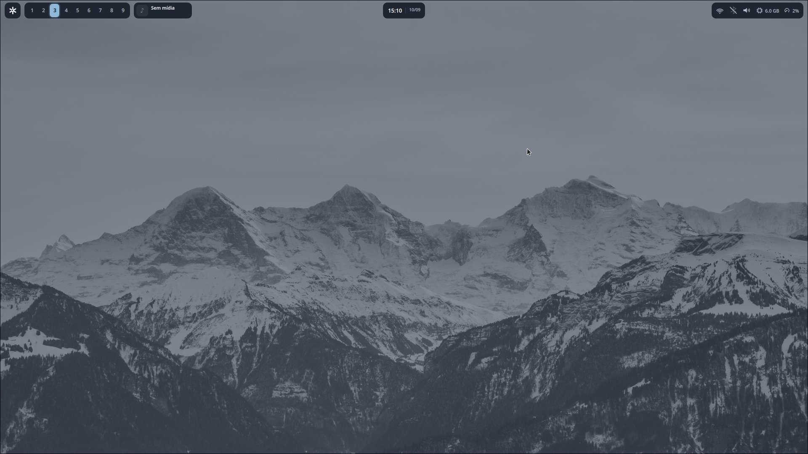
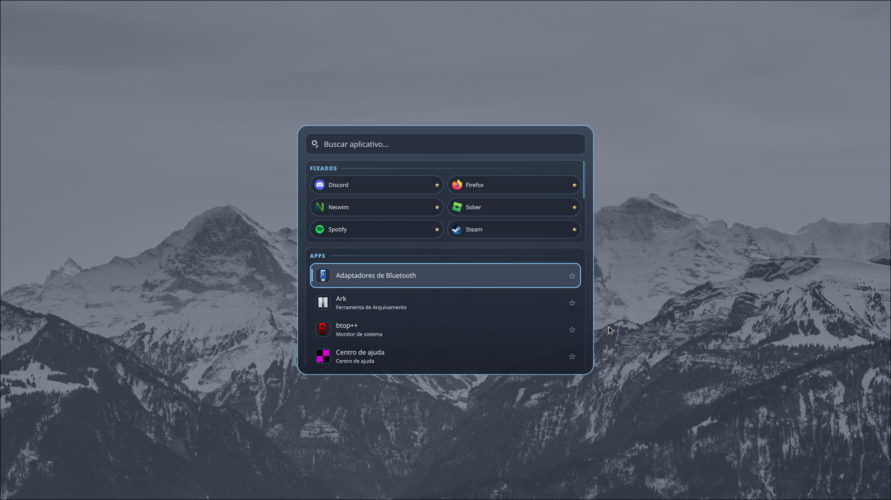
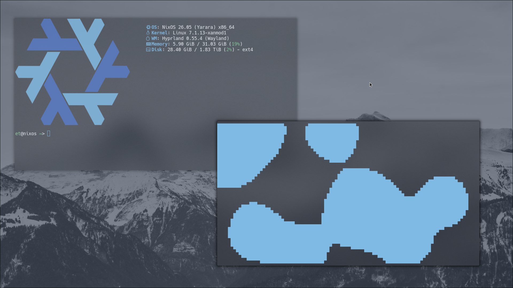

# NixOS Dotfiles

> My **NixOS + Hyprland** desktop configuration.

This repository is mainly a place to keep my configuration **version-controlled and organized**, while making it public for anyone who happens to find something useful here.

This is **not a configuration made for popularity, stars, or ricing competitions**. It's simply my personal setup, shared publicly.

---

## Screenshots

### Empty Desktop


---

### Quickshell Topbar (unfinished)



---

### Quickshell Launcher



---

### Normal Desktop



---

## What's Inside

```text
Nix-Dots
├── Hyprland
│   ├── Hypr
│   │   ├── hyprland.lua
│   │   └── hyprpaper.conf
│   ├── nord.jpg
│   ├── quickshell-launcher
│   │   ├── launcher
│   │   │   ├── AppEntry.qml
│   │   │   ├── Launcher.qml
│   │   │   ├── pinned.json
│   │   │   ├── PinStore.qml
│   │   │   ├── qmldir
│   │   │   ├── shell.qml
│   │   │   └── Theme.qml
│   │   └── pinned.json
│   └── quickshell-topbar
│       └── topbar
│           ├── Bar.qml
│           ├── Bluetooth.qml
│           ├── Brightness.qml
│           ├── ChipIcon.qml
│           ├── ClockCalendar.qml
│           ├── Colors.qml
│           ├── config.toml.snippet
│           ├── DeviceList.qml
│           ├── MediaIconButton.qml
│           ├── MediaPlayer.qml
│           ├── NixButton.qml
│           ├── Osd.qml
│           ├── Popup.qml
│           ├── qmldir
│           ├── quickshell-colors.json
│           ├── shell.qml
│           ├── stats.sh
│           ├── StatusPill.qml
│           ├── SystemStats.qml
│           ├── Volume.qml
│           ├── Wifi.qml
│           └── Workspaces.qml
├── Nix
│   ├── configuration.nix
│   └── hardware-configuration.nix
├── Nvim
│   ├── init.lua
│   ├── lazy-lock.json
│   └── lua
│       ├── config
│       │   ├── keybinds.lua
│       │   ├── lazy.lua
│       │   └── options.lua
│       └── plugins
│           ├── alpha.lua
│           ├── colors.lua
│           ├── completion.lua
│           ├── lsp.lua
│           ├── oneliners.lua
│           ├── telescope.lua
│           └── treesitter.lua
├── README.md
├── Screenshots
│   ├── desktop.png
│   ├── emptydesk.png
│   ├── qslauncher.png
│   └── topbar-beta.png
└── Terminal
    ├── fastfetch
    │   ├── config.jsonc
    │   └── nixos.png
    ├── fish
    │   ├── completions
    │   ├── conf.d
    │   ├── config.fish
    │   ├── fish_variables
    │   └── functions
    └── kitty
        ├── colors.conf
        └── kitty.conf
````

---

### Hyprland

Includes:

* Hyprland
* Hyprpaper
* Window rules
* Workspace configuration
* Keybinds
* Quickshell integration
* Various desktop behavior tweaks

**The entire Hyprland configuration is currently contained in a single file. I may change this later.**

---

### Quickshell

The repository currently contains two main Quickshell components:

* **Topbar**
* **Launcher**

The Topbar is still under development and should be considered **unfinished and experimental**.

---

### Neovim

It currently includes things such as:

* LSP
* Autocompletion
* Treesitter
* Telescope
* Dracula Theme
* Various quality-of-life plugins

---

### Terminal

* **Shell:** Fish
* **Terminal:** Kitty
* **System information:** Fastfetch

---

## Main Keybinds

These are some of the main Hyprland shortcuts:

|   Keybind   | Action                                          |
| :---------: | ----------------------------------------------- |
| `Super + Q` | Open terminal                                   |
| `Super + C` | Close active window                             |
| `Super + D` | Open launcher                                   |
| `Super + V` | Toggle floating window                          |
| `Super + F` | Maximize/stretch window without true fullscreen |

There are additional keybinds throughout the configuration.

---

## System

This configuration was developed primarily on a **NixOS desktop running Hyprland with NVIDIA graphics**.

Because this is a personal configuration, some parts are tied to my own hardware and workflow.

If you're using a different GPU or system, especially **AMD or Intel graphics**, some hardware-specific settings may need to be changed.

---

## Language

Some parts of the configuration are written in **Brazilian Portuguese (`pt-BR`)**.

This includes some comments, naming, and configuration-related text.

I may translate or clean these up in the future, but for now they remain as part of my personal setup.

---

## NixOS & Flakes

This configuration **does not use Nix flakes** at the moment.

It's currently based around a more traditional NixOS configuration.

I may eventually add:

* `flake.nix`
* A more modular Nix structure
* Home Manager

Nothing is set in stone, though. I'll add these if they actually make sense for the configuration.

---

## Status

> **Work in progress.**

Not everything here is finished.

Some parts are stable, while others are still experimental or have known issues.

Current rough edges include:

* Quickshell components still being developed
* Incomplete modules
* Hardware-specific configuration
* Configuration that hasn't been fully generalized
* Things that may simply break while I'm changing them

So, if something doesn't work, **that's not necessarily a surprise**.

---

If you find something useful here, feel free to use it.

If something doesn't work on your machine, you'll probably need to adapt it.

**This repository is not intended to be a universal NixOS configuration or a plug-and-play rice.**

---

## Future Plans

Some things I might work on in the future:

* Add a Nix flake
* Improve the Quickshell launcher
* Finish the Quickshell topbar
* Clean up the configuration structure
* Reduce hardware-specific assumptions
* Improve documentation
* Add more reusable modules

These aren't commitments. The repository will simply evolve alongside my desktop.

Some things will get removed, rewritten, broken, fixed, or replaced.

---

**maintained by 143.**
